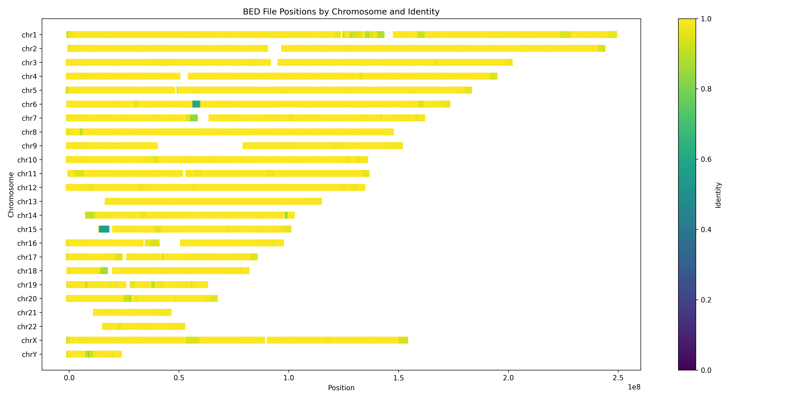

# wambam

Wambam is made for quick bam QC: read identity, read lengths, N50, total yield.

## Usage

Use with:

```sh
wam -i reads.bam -o wambam_results
```

The input BAM must be made by aligning long reads with [minimap2](https://github.com/lh3/minimap2) using the `--eqx` flag. Wambam uses the cigar string to calculate the identity of the alignments in the BAM relative to the reference. The default behavior is to use mismatches `X` and insertions and deletions `I & D` that are less than 50 base pairs as nonmatches. These are used in the identity calculation of matches divded by matches + nonmatches. The maximum INDEL length can be set by the user as a comand line argument `-l`. 

The output directory specified with `-o` will be created and must not exist. 

## Docker container

A docker container with wambam is deployed at [`quay.io/jmonlong/wambam`](https://quay.io/repository/jmonlong/wambam).
It was made with this [Dockerfile](Dockerfile).

It also has R and the packages necessary to make the graphs and summary statistics with [the scripts described below](#graphs-and-summary-statistics).

Within the docker container, this repo is located at `/build/wambam`. 
So the script to make plots is at `/build/wambam/scripts/make_plots.R` for example.

## WDL workflow

A WDL workflow is available to:

1. align the reads with minimap2 (if necessary)
2. run wambam
3. make some graphs and compute summary stats

The workflow is [deposited on Dockstore](https://dockstore.org/workflows/github.com/nanoporegenomics/wambam/wambam:main?tab=info).

The tasks, workflow, and example input are in the [`wdl` folder](wdl).

To test locally with [Cromwell](https://cromwell.readthedocs.io/en/stable/):

```sh
java -jar $CROMWELL_JAR run wdl/workflow.wdl -i wdl/testdata_input.json
```

*`$CROMWELL_JAR` points at a `cromwell-*.jar` [Cromwell release](https://github.com/broadinstitute/cromwell/releases).*

## Example output

The main executable generates an output directory containing two CSVs:

1. `identity_distribution.csv` describing a histogram of observed read-level identity. For example:
    ```
    0.9942,11
    0.9946,56
    0.9947,113
    ...
    ```


2. `length_distribution.csv` describing a histogram of observed read lengths. For example:
    ```
    35609,3
    35610,4
    35614,2
    ...
    ```


These two files can be used to plot the distribution of identity, read length, and N50.

The [scripts/make_plots.R](scripts/make_plots.R) script shows how to make some graphs and compute the summary statistics (e.g. median identity, read N50).
It's used in the WDL workflow described above.

The first two arguments are the identity and length CSV files described above.
The last two arguments are the name of the output PDF and summary CSV files.
To use it locally:

```sh
Rscript make_plots.R identity_distribution.csv length_distribution.csv wambam-graphs.pdf wambam-summary.csv
```

Note: the scripts use the *dplyr* and *ggplot2* packages that can be installed in R with `install.packages(c("dplyr", "ggplot2"))`.

3. `alignment_summary_50bpMaxIndel.tsv` describing the alignment per query in the BAM including the identity, matches, nonmatches, large INDELs greater than max INDEL length, total length of the large INDELs in the query, the inferred length of the query sequence ( not just the alignment length ), the mapq, and a unique alignment identifier. 
```
#chr    start_pos   end_pos identity    matches nonmatches  largeINDELs largeINDEL_total_length inferred_len    mapq    alignmentName
track type=bedGraph name="identity" autoScale=on
chr1    1664    1814    0.986667    148 2   0   0   150 60  8281a794128cc10b__chr1_1664_1814_148_2
chr1    8948    9098    0.993333    149 1   0   0   150 60  76b8c8a10bc5daf6__chr1_8948_9098_149_1
```

4. `alignment_summary_50bpMaxIndel.tsv.sorted.bed` a bedGraph file that can be used to view alignments and their identity scores on IGV. 


Here are a few examples of graphs made by the scripts (and WDL):

#### Identity distribution


#### Identity distribution zoomed in


#### Read length distribution (log-scaled axis)


#### Read length NX


*The 0-0.05 range is not shown to improve visibility because the longest reads tend to dwarf the rest of the distribution and we are more interested in the higher NXs.*

#### Alignment Identity per Chromosome
This plot is made using [scripts/plot_alignments.py](scripts/plot_alignments.py) and the alignment_summary.tsv output file. 




#### Comparing multiple samples

The [scripts/make_plots_multisamples.R](scripts/make_plots_multisamples.R) script shows how to make some graphs comparing wambam results on multiple samples.
The first argument is a TSV file with three columns: `sample` with the sample name, `identity` with the path to the *identity_distribution.csv*, `length` with the path to the *length_distribution.csv*. 
[scripts/input_samples.tsv](scripts/input_samples.tsv) is an example of this input TSV. 
The other two arguments are the output PDF, and output summary table.

```sh
Rscript make_plots_multisamples.R input_samples.tsv wambam-graphs-samples.pdf wambam-summary-samples.csv
```

Similar graphs as above are made but showing different samples.
For example:


